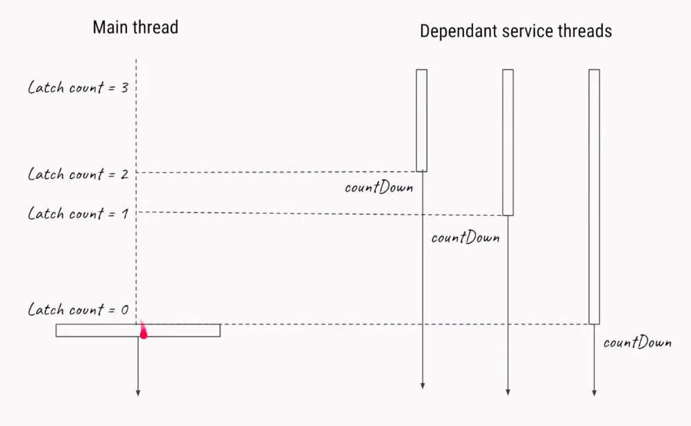
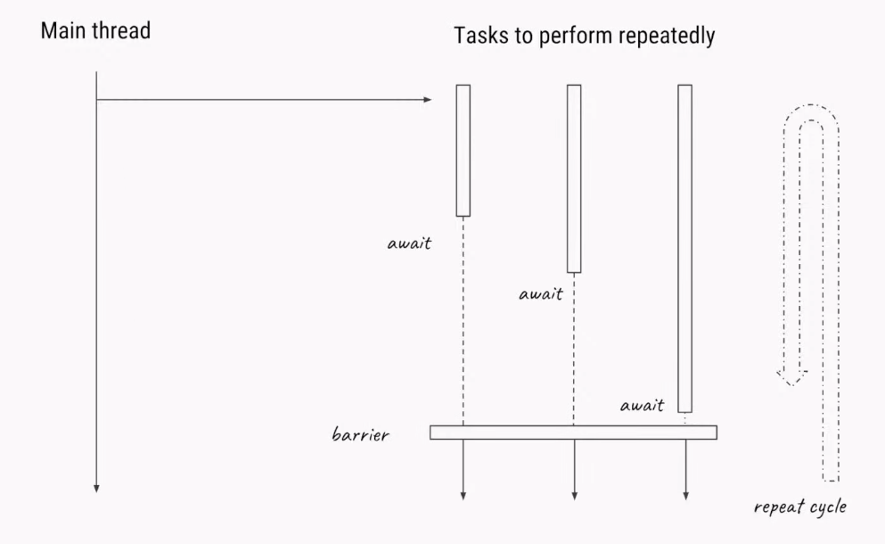
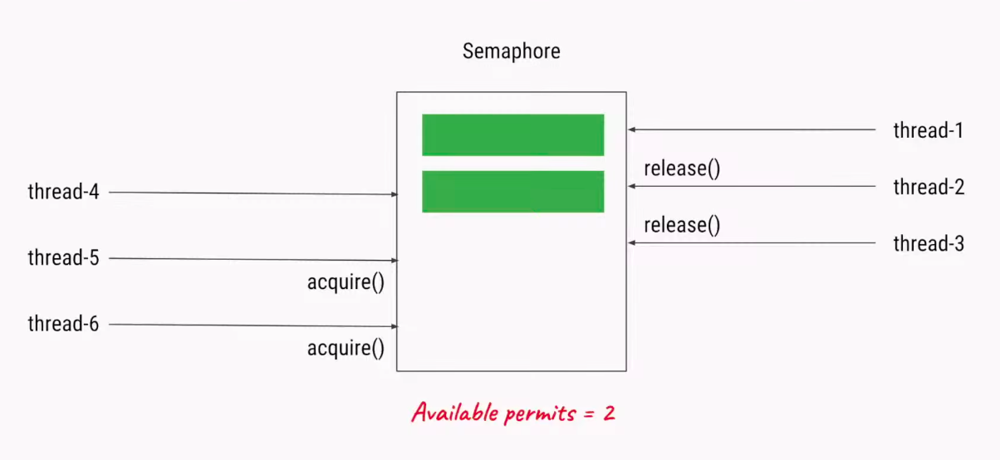

# Java Synchronizers
- [CountDownLatch](#CountDownLatch)
- [CyclicBarrier](#CyclicBarrier)
- [Semaphore](#Semaphore)

## CountDownLatch
In this case we have three services running on separate threads. Each service have to do some heavy initialization on it's `run()` method (e.g. connect to DB, retrieving some information). With `CountDownLatch` we can await until all the services are initialized. See the [code example](CountDownLatchDemo.java).

## CyclicBarrier
Consider a case when you have tasks that perform repeatedly on separate threads and you have to await all tasks to finish before to continue further. This task can represent separate computations that will be jointed and the result can be used for another computations. For example something like *Fork/Join* or *Map/Reduce* tasks. In this scenario we can use `CyclicBarrier`. See the [code example](CyclicBarrierDemo.java).

## Semaphore
Let's have a slow service and a pool with 50 threads and 1000 tasks for this service. Because the service is slow there is a limitation of maximum 3 connections to this service. In this case is appropriate to limit number of the threads that want to connect to the service to avoid a race condition. This is the case when the `Semaphore`comes into play. See the [code example](SemaphoreDemo.java).

