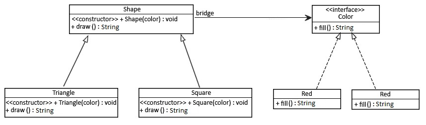

# Bridge pattern
The **Bridge** pattern decouples an abstraction from its implementation so that the two can vary independently

## When to use
- When we want a parent abstract class to define the set of basic rules, and the concrete classes to add additional rules
- When we have an abstract class that has a reference to the objects, and it has abstract methods that will be defined in each of the concrete classes

(image source: https://www.baeldung.com/)

(image source: https://springframework.guru)

